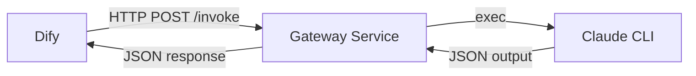

# Design Document

## Overview

这是一个极简的 Go HTTP 网关服务，实现 Dify 到 Claude CLI 的请求转发。整个服务由单个 Go 文件实现，包含 HTTP handler、prompt 构建器和 CLI 执行器三个核心组件。

## Architecture



### 组件职责

1. **HTTP Handler**: 接收 POST 请求，解析 JSON，返回响应
2. **Prompt Builder**: 将 messages 数组拼接成 Claude CLI 可用的 prompt
3. **CLI Executor**: 执行 claude 命令，解析 JSON 输出

## Components and Interfaces

### 数据结构

```go
// Message 表示单条对话消息
type Message struct {
    Role    string `json:"role"`    // "user" 或 "assistant"
    Content string `json:"content"` // 消息内容
}

// InvokeRequest 表示 Dify 发送的请求
type InvokeRequest struct {
    System   string    `json:"system"`   // 系统提示词（可选）
    Messages []Message `json:"messages"` // 对话历史
    Profile  string    `json:"profile"`  // 配置 profile 名称（可选）
    CLI      string    `json:"cli"`      // CLI 工具名称（可选，"claude" 或 "codex"，默认 "claude"）
}

// ChatRequest 表示简化的聊天请求
type ChatRequest struct {
    Prompt  string `json:"prompt"`  // 用户输入的问题
    System  string `json:"system"`  // 系统提示词（可选）
    Profile string `json:"profile"` // 配置 profile 名称（可选，如 "kimi", "minimax", "glm"）
    CLI     string `json:"cli"`     // CLI 工具名称（可选，"claude" 或 "codex"，默认 "claude"）
}

// InvokeResponse 表示返回给 Dify 的响应
type InvokeResponse struct {
    Answer string `json:"answer"` // Claude 生成的回答
}

// ClaudeOutput 表示 Claude CLI 的 JSON 输出格式
type ClaudeOutput struct {
    Result string `json:"result"` // 提取这个字段作为答案
}

// ProfileConfig 表示单个配置 profile
type ProfileConfig struct {
    Name string            `json:"name"`
    CLI  string            `json:"cli"`  // 可选：指定使用的 CLI 工具（"claude" 或 "codex"）
    Env  map[string]string `json:"env"`
}
```

### 核心函数

#### 1. buildPrompt

```go
// buildPrompt 将 messages 拼接成单个 prompt 字符串
// 格式：
// User: <content>
// Assistant: <content>
// User: <content>
func buildPrompt(messages []Message) string
```

**实现逻辑**:
- 遍历 messages 数组
- 根据 role 添加前缀 "User:" 或 "Assistant:"
- 用换行符连接所有消息
- 返回拼接后的字符串

#### 2. runCLI

```go
// runCLI 执行指定的 CLI 工具并返回结果
// 参数：
//   - cliName: CLI 工具名称（"claude" 或 "codex"）
//   - prompt: 拼接好的对话内容
//   - systemPrompt: 系统提示词（可为空）
//   - profileName: 配置 profile 名称（可为空）
// 返回：
//   - result: CLI 的回答
//   - error: 执行错误
func runCLI(cliName string, prompt string, systemPrompt string, profileName string) (string, error)
```

**实现逻辑**:
1. 确定使用的 CLI 工具：
   - 如果 cliName 非空，使用 cliName
   - 否则，如果 profile 有 CLI 字段，使用 profile.CLI
   - 否则，默认使用 "claude"
2. 根据 CLI 类型构建命令参数：
   - **Codex CLI**: `codex exec --model gpt-5.1 --sandbox danger-full-access <prompt>`
     - `--sandbox danger-full-access` 允许联网访问
     - System prompt 和 prompt 合并为一个参数
     - 返回纯文本格式
   - **Claude CLI**: `claude --print <prompt> --output-format json --allowedTools WebSearch [--add-dir <path>]`
     - System prompt 使用 `--append-system-prompt` 参数
     - Skills 使用 `--add-dir` 参数添加目录访问权限
     - 返回 JSON 格式
3. 构建命令参数数组：
   ```go
   args := []string{"--print", prompt, "--output-format", "json", "--allowedTools", "WebSearch"}
   ```
3. 如果 systemPrompt 非空，添加：
   ```go
   args = append(args, "--append-system-prompt", systemPrompt)
   ```
4. 执行命令：
   ```go
   cmd := exec.Command(cliName, args...)  // 使用 cliName 而不是硬编码 "claude"
   output, err := cmd.CombinedOutput()
   ```
5. 应用 profile 环境变量（如果有）
6. 检查错误：如果 err != nil，返回错误信息
7. 解析 JSON 输出：
   ```go
   var cliOut ClaudeOutput
   json.Unmarshal(output, &cliOut)
   ```
8. 返回 `cliOut.Result`

#### 3. handleInvoke

```go
// handleInvoke 处理 /invoke 端点的 HTTP 请求
func handleInvoke(w http.ResponseWriter, r *http.Request)
```

**实现逻辑**:
1. 检查请求方法是否为 POST
2. 解析 JSON 请求体到 InvokeRequest
3. 调用 buildPrompt 构建 prompt
4. 调用 runCLI 执行 CLI（传入 cli、prompt、system 和 profile）
5. 如果成功，返回 200 + InvokeResponse
6. 如果失败，返回 500 + 错误信息

#### 4. handleChat

```go
// handleChat 处理 /chat 端点的简化 HTTP 请求
func handleChat(w http.ResponseWriter, r *http.Request)
```

**实现逻辑**:
1. 检查请求方法是否为 POST
2. 解析 JSON 请求体到 ChatRequest
3. 直接使用 prompt 字段作为用户输入
4. 调用 runCLI 执行 CLI（传入 cli、prompt、system 和 profile）
5. 如果成功，返回 200 + InvokeResponse
6. 如果失败，返回 500 + 错误信息

## Data Models

### 请求示例

**完整格式 (/invoke)**

```json
{
  "system": "你是一个有帮助的助手",
  "messages": [
    {"role": "user", "content": "什么是 Go 语言？"},
    {"role": "assistant", "content": "Go 是 Google 开发的编程语言..."},
    {"role": "user", "content": "它有什么特点？"}
  ]
}
```

**简化格式 (/chat)**

```json
{
  "prompt": "什么是 Go 语言？",
  "system": "你是一个有帮助的助手",
  "profile": "kimi",
  "cli": "claude"
}
```

使用 codex CLI：

```json
{
  "prompt": "什么是 Go 语言？",
  "cli": "codex"
}
```

或者最简形式：

```json
{
  "prompt": "什么是 Go 语言？"
}
```

支持的参数：
- `cli`: CLI 工具名称（"claude" 或 "codex"，可选）
  - 如果指定，覆盖 profile 中的 CLI 设置
  - 如果不指定，使用 profile 中的 CLI 设置
  - 如果 profile 也没有指定，默认使用 "claude"
- `profile`: 配置名称（"kimi", "minimax", "glm", "kimi-k2"，默认使用 configs.json 中的 default）
- `system`: 系统提示词（可选）
- `prompt`: 用户输入（必需）

### 配置文件示例

```json
{
  "profiles": {
    "kimi": {
      "name": "Kimi",
      "cli": "claude",
      "env": {
        "ANTHROPIC_BASE_URL": "https://api.kimi.com/coding/",
        "ANTHROPIC_AUTH_TOKEN": "xxx"
      }
    },
    "codex-profile": {
      "name": "Codex Profile",
      "cli": "codex",
      "env": {
        "ANTHROPIC_BASE_URL": "https://api.codex.com/",
        "ANTHROPIC_AUTH_TOKEN": "xxx"
      }
    }
  },
  "default": "kimi"
}
```

### 响应示例

```json
{
  "answer": "Go 语言的主要特点包括：1. 并发支持..."
}
```

### Claude CLI 输出示例

```json
{
  "type": "result",
  "result": "Go 语言的主要特点包括...",
  "total_cost_usd": 0.003,
  "duration_ms": 1234
}
```

## Error Handling

### 错误场景

1. **请求方法错误**: 返回 405 Method Not Allowed
2. **JSON 解析失败**: 返回 400 Bad Request
3. **Claude CLI 执行失败**: 返回 500 Internal Server Error
4. **JSON 输出解析失败**: 返回 500 Internal Server Error

### 错误响应格式

```json
{
  "error": "错误描述信息"
}
```

## Testing Strategy

### 手动测试

使用 curl 测试端点：

```bash
curl -X POST http://localhost:8080/invoke \
  -H "Content-Type: application/json" \
  -d '{
    "system": "你是一个助手",
    "messages": [
      {"role": "user", "content": "你好"}
    ]
  }'
```

### 验证点

1. 服务能否正常启动并监听 8080 端口
2. 能否正确解析 JSON 请求
3. 能否正确拼接 prompt
4. 能否成功调用 Claude CLI
5. 能否正确解析 Claude 输出并返回

## Implementation Notes

### 文件结构

```
dify-cli-gateway/
├── main.go          # 程序入口，启动 HTTP 服务器
├── handler.go       # HTTP handler 实现
├── claude.go        # Claude CLI 调用逻辑
├── types.go         # 数据结构定义
└── go.mod           # Go module 定义
```

### 模块职责

**main.go**
- 程序入口
- 注册路由
- 启动 HTTP 服务器

**types.go**
- 定义 Message、InvokeRequest、InvokeResponse 结构体
- 定义 ClaudeOutput 结构体

**handler.go**
- 实现 handleInvoke 函数
- 处理 HTTP 请求和响应
- 调用 claude 模块

**claude.go**
- 实现 buildPrompt 函数
- 实现 runClaude 函数
- 封装 Claude CLI 调用逻辑

### main 函数

```go
func main() {
    http.HandleFunc("/invoke", handleInvoke)
    http.HandleFunc("/chat", handleChat)
    log.Println("Gateway service starting on :8080")
    log.Fatal(http.ListenAndServe(":8080", nil))
}
```

### 依赖包

- `net/http`: HTTP 服务器
- `encoding/json`: JSON 编解码
- `os/exec`: 执行外部命令
- `log`: 简单日志输出
- `strings`: 字符串拼接

### 关键设计决策

1. **模块化结构**: 按职责分离到不同文件，便于维护和测试
2. **无鉴权**: 暂不实现 token 验证，后续可添加
3. **无日志详情**: 只在启动时打印一条日志
4. **硬编码端口**: 使用固定的 8080 端口
5. **固定工具集**: 始终启用 WebSearch 工具
6. **同步处理**: 不使用 goroutine，简单的请求-响应模式

### 扩展点

后续可以添加的功能：
- Bearer token 鉴权
- 详细的请求日志
- 可配置的端口和工具列表
- 支持其他 CLI 客户端（Qwen、Kimi 等）
- 请求超时控制
- 并发请求限制
