# CLI Gateway

一个极简的 Go HTTP 网关服务，将 HTTP 请求桥接到多种 AI CLI 工具。通过统一的 HTTP 接口调用各种 CLI 的无头模式，让任何支持 HTTP 的应用（Web 应用、移动端、IoT 设备等）都能使用这些 CLI 的强大能力。



[集成dify,实现多轮对话Agent.](https://github.com/myysophia/cli-agent/tree/main/images)

[集成bisheng,实现多轮对话Agent.](https://github.com/myysophia/cli-agent/blob/main/images/bisheng%E6%8A%95%E7%A0%94%E6%99%BA%E8%83%BD%E4%BD%93.png)


**核心特性**：
- 🌐 **通用 HTTP 接口**：任何能发起 HTTP 请求的客户端都可以使用
- 🚀 **流式输出支持**：支持 SSE (Server-Sent Events) 实时流式响应
- 🔌 **多 CLI 集成**：统一接口调用 Claude、Codex、Cursor、Gemini、Qwen 等
- 🛠️ **MCP 工具链**：支持 WebFetch、Playwright 等扩展工具
- 📦 **开箱即用**：无需复杂配置，快速部署到任何环境

## 支持的 CLI 工具

| CLI | 说明 | 模型示例 |
|-----|------|----------|
| `claude` | Anthropic Claude Code CLI | claude-sonnet-4, 支持第三方 API |
| `codex` | OpenAI Codex CLI | gpt-5.1 |
| `cursor` | Cursor Agent CLI | auto, gpt-5, sonnet-4 |
| `gemini` | Google Gemini CLI | gemini-2.5-pro, gemini-2.5-flash |
| `qwen` | 阿里 Qwen Code CLI | qwen3-max |


## 功能特性

### CLI 调用功能
- 提供 HTTP POST 接口 `/invoke` 和 `/chat` 接收对话请求
- 自动将对话历史转换为 CLI 的 prompt 格式
- 支持系统提示词（system prompt）
- **支持 5 种 CLI 工具**（Claude、Codex、Cursor、Gemini、Qwen）

### Release Notes 功能
- 📋 **API 接口**：获取各 CLI 工具的版本更新信息
  - `GET /release-notes` - 获取所有 CLI 的 release notes
  - `GET /release-notes/{cli_name}` - 获取指定 CLI 的 release notes
- 🎨 **HTML 可视化界面**：`/release-notes/view`
  - 标签式界面，支持搜索和过滤
  - Markdown 渲染，自动链接 GitHub issues/PRs
  - 版本对比，显示本地版本和最新版本
- 🔄 **自动刷新**：定时从外部源获取最新数据（默认 1 小时）
- 💾 **缓存机制**：内存缓存 + 文件持久化
- ✅ **只显示正式版本**：自动过滤 alpha、beta、nightly、preview 等版本

### Cursor Agent CI 集成
- 🤖 **自动化测试**：使用 Cursor Agent CLI 进行 AI 驱动的代码分析
- 📊 **定时运行**：每天自动运行测试任务
- 🔧 **MCP 工具支持**：集成 filesystem、fetch 等 MCP 服务器
- 📝 **测试报告**：自动生成并上传测试报告

详细配置请查看：[Cursor Agent CI 指南](docs/CURSOR_AGENT_CI.md)

## 项目结构

```
cli-agent/
├── cmd/
│   └── server/
│       └── main.go               # 主入口
├── internal/                     # 私有应用代码
│   ├── cli/                      # CLI 工具接口和实现
│   │   ├── interface.go         # CLI 接口定义
│   │   ├── factory.go           # CLI 工厂
│   │   ├── claude.go            # Claude CLI 实现
│   │   ├── cursor.go            # Cursor CLI 实现
│   │   ├── codex.go             # Codex CLI 实现
│   │   ├── gemini.go            # Gemini CLI 实现
│   │   └── qwen.go              # Qwen CLI 实现
│   ├── handler/                  # HTTP 处理器
│   │   ├── handler.go           # 通用处理器
│   │   ├── claude.go            # Claude 处理器
│   │   ├── release_notes_handler.go  # Release Notes API 处理器
│   │   ├── config.go            # 配置管理
│   │   └── types.go             # 类型定义
│   └── release_notes/            # Release Notes 功能模块
│       ├── *_fetcher.go         # 各 CLI 的数据获取器
│       ├── cache.go             # 缓存层
│       ├── storage.go           # 持久化存储
│       ├── service.go           # 核心服务
│       ├── types.go             # 类型定义
│       └── *_test.go            # 测试文件（含 Property-Based Tests）
├── web/
│   └── templates/
│       └── release_notes.html   # Release Notes 查看器
├── configs/                      # 配置文件
│   ├── configs.json             # 当前配置
│   └── configs.example.json     # 配置示例
├── scripts/                      # 工具脚本
├── docs/                         # 文档
│   ├── CHANGELOG.md             # 更新日志
│   └── SKILLS.md                # 技能文档
├── data/                         # 数据文件
├── logs/                         # 日志文件
└── .kiro/specs/                  # 功能规格文档
```
- 支持 Claude Skills（访问本地文件和目录）
- **支持 MCP 工具调用**（WebFetch、Playwright 等）
- 支持会话管理（session_id 和 resume）
- 调用 CLI 无头模式获取响应
- 返回 JSON 格式的结果
- 支持多配置 profile 管理
- 自动日志记录（按日期分文件）

## 使用场景

- 🌐 **Web 应用集成**：为前端应用提供 AI 能力，支持实时流式响应
- 📱 **移动端接入**：iOS/Android 应用通过 HTTP 调用 AI 服务
- 🤖 **工作流平台**：Dify、n8n、Zapier 等低代码平台的自定义节点
- 🔧 **自动化脚本**：CI/CD、定时任务、批处理中调用 AI
- 🏠 **IoT 设备**：智能家居、边缘计算设备的 AI 接口
- 🧪 **本地开发测试**：快速搭建本地 AI API 服务进行原型验证
- 📊 **数据处理管道**：ETL 流程中的智能数据分析和转换

## 前置要求

1. **Go 环境**: Go 1.16 或更高版本
2. **CLI 工具**: 至少安装并配置好以下一种 CLI：
   - `claude` - Anthropic Claude Code CLI
   - `codex` - OpenAI Codex CLI
   - `cursor-agent` - Cursor Agent CLI
   - `gemini` - Google Gemini CLI
   - `qwen` - 阿里 Qwen Code CLI

## 快速开始

### 1. 构建项目

```bash
# 初始化 Go module（如果还没有）
go mod init claude-cli-gateway

# 构建可执行文件
go build -o claude-cli-gateway
```

### 2. 启动服务

```bash
# 方式一：使用启动脚本（推荐）
./start.sh                    # 默认端口 8080
./start.sh -p 3000           # 自定义端口 3000

# 方式二：使用环境变量
PORT=9000 ./start.sh         # 端口 9000

# 方式三：直接运行
./claude-cli-gateway         # 使用配置文件或默认端口
PORT=3000 ./claude-cli-gateway  # 环境变量指定端口
```

服务将在 `http://localhost:8080` 启动（或你指定的端口）。

**端口配置优先级**: 环境变量 > 配置文件 > 默认值(8080)

详细配置请查看：[端口配置指南](docs/PORT_CONFIGURATION.md)

## Docker 部署

> 镜像默认使用 `configs/configs.example.json` 作为 `configs.json`，建议通过挂载自定义配置覆盖。
> 镜像内置安装 Claude Code、Codex 与 Cursor Agent（最新版本）。

### 构建镜像

```bash
docker build -t dify-cli-gateway:local .
```

### 运行容器

```bash
# 挂载自定义配置文件（推荐）
docker run --rm -p 8080:8080 \
  -v "$(pwd)/configs.json:/app/configs.json:ro" \
  dify-cli-gateway:local

# 仅使用环境变量（不提供 configs.json）
docker run --rm -p 8080:8080 \
  -e PORT=8080 \
  dify-cli-gateway:local
```

### MCP 与 Skills 挂载

容器内默认使用以下路径读取 MCP 配置：
- Cursor Agent: `/home/app/.cursor/mcp.json`
- Claude CLI: `/home/app/.claude/settings.json`
- Codex CLI: `/home/app/.codex/config.toml`

容器内已安装 MCP 运行时依赖：
- `uv/uvx`（用于 `mcp-server-fetch`、`mcp-server-filesystem` 等）
- `python3`
- `nodejs/npx`（用于 `@playwright/mcp` 等）

建议把主机配置目录挂载进去，并把 Skills 目录也挂载到 `/app` 下：

```bash
docker run --rm -p 8080:8080 \
  -v "$(pwd)/configs.json:/app/configs.json:ro" \
  -v "$HOME/.cursor:/home/app/.cursor:ro" \
  -v "$HOME/.cursor-agent:/home/app/.cursor-agent:ro" \
  -v "$HOME/.claude:/home/app/.claude:ro" \
  -v "$HOME/.codex:/home/app/.codex:ro" \
  -v "$(pwd)/skills:/app/skills:ro" \
  dify-cli-gateway:local
```

在 `configs.json` 的 `skills` 字段中请使用容器内路径，例如：`/app/skills` 或 `/app/reporter`。

为防止泄露敏感信息，网关会自动屏蔽包含 `configs.json` 的 skills 路径（例如 `.` 或 `/app`）。
请将 skills 指向更精确的子目录（如 `/app/skills`、`/app/reporter`、`/app/docs`）。

### GitHub Actions 自动构建镜像

默认推送到 `ghcr.io/<owner>/<repo>`，需要在仓库设置中开启 `Packages` 写权限。

### 3. 测试接口

使用 curl 测试：

```bash
curl -X POST http://localhost:8080/invoke \
  -H "Content-Type: application/json" \
  -d '{
    "system": "你是一个有帮助的助手",
    "messages": [
      {"role": "user", "content": "什么是 Go 语言？"}
    ]
  }'
```

预期响应：

```json
{
  "answer": "Go 是 Google 开发的一种静态类型、编译型编程语言..."
}
```

## API 文档

### POST /invoke

调用 Claude CLI 获取模型响应（适用于多轮对话）。

**请求格式**:

```json
{
  "profile": "配置名称（可选，默认使用 configs.json 中的 default）",
  "cli": "CLI 工具名称（可选，'claude' 或 'codex'）",
  "system": "系统提示词（可选）",
  "messages": [
    {"role": "user", "content": "用户消息"},
    {"role": "assistant", "content": "助手回复"},
    {"role": "user", "content": "用户继续提问"}
  ]
}
```

**字段说明**:
- `profile` (string, 可选): 指定使用的配置 profile（如 "cursor", "gemini", "codex"）
- `cli` (string, 可选): CLI 工具名称（"claude", "codex", "cursor", "gemini", "qwen"）
- `system` (string, 可选): 系统提示词，用于设定 AI 的行为和角色
- `messages` (array, 必需): 对话历史消息列表
  - `role` (string): 消息角色，可选值 `"user"` 或 `"assistant"`
  - `content` (string): 消息内容

**成功响应** (200 OK):

```json
{
  "answer": "{\"session_id\":\"xxx\",\"user\":\"问题\",\"codex\":\"回答内容\"}"
}
```

### POST /chat

简化的聊天接口（推荐使用），支持流式和非流式输出。

**请求格式**:

```json
{
  "profile": "配置名称（可选）",
  "cli": "CLI 工具名称（可选）",
  "prompt": "你的问题",
  "system": "系统提示词（可选）",
  "session_id": "会话ID（可选，用于继续对话）",
  "new_session": false,
  "allowed_tools": ["WebFetch", "playwright"],
  "permission_mode": "bypassPermissions",
  "stream": false
}
```

**字段说明**:
- `profile` (string, 可选): 指定使用的配置 profile
- `cli` (string, 可选): CLI 工具名称（"claude", "codex", "cursor", "gemini", "qwen"）
- `prompt` (string, 必需): 用户问题或指令
- `system` (string, 可选): 系统提示词
- `session_id` (string, 可选): 会话 ID，用于继续之前的对话
- `new_session` (boolean, 可选): 是否创建新会话（默认 false）
- `allowed_tools` (array, 可选): 允许使用的 MCP 工具列表
- `permission_mode` (string, 可选): 权限模式（"bypassPermissions" 自动授权）
- `stream` (boolean, 可选): 是否启用流式输出（默认 false）

**非流式响应** (200 OK):

```json
{
  "answer": "{\"session_id\":\"xxx\",\"user\":\"问题\",\"codex\":\"回答内容\"}"
}
```

**流式响应** (SSE 格式):

当 `stream: true` 时，响应为 Server-Sent Events (SSE) 流：

```
Content-Type: text/event-stream

data: {"type":"start","session_id":"xxx"}

data: {"type":"content","text":"这是"}

data: {"type":"content","text":"流式"}

data: {"type":"content","text":"输出"}

data: {"type":"done"}
```

**流式输出示例**:
```bash
# 使用 curl 接收流式输出
curl -N -X POST http://localhost:8080/chat \
  -H "Content-Type: application/json" \
  -d '{
    "prompt": "写一首诗",
    "stream": true
  }'
```

**错误响应**:

- **400 Bad Request**: JSON 格式错误
  ```json
  {"error": "Invalid JSON request body"}
  ```

- **405 Method Not Allowed**: 使用了非 POST 方法
  ```json
  {"error": "Method not allowed"}
  ```

- **500 Internal Server Error**: Claude CLI 执行失败
  ```json
  {"error": "claude CLI execution failed: ..."}
  ```

## 配置说明

### 基本配置

- **端口**: 8080
- **Claude CLI 工具**: WebSearch（固定启用）
- **输出格式**: JSON
- **日志**: 自动记录到 `logs/` 目录，按日期分文件（如 `logs/2025-11-18.log`）

### 多配置支持

网关支持多个 Claude API 配置（MiniMax、智谱 GLM、Kimi 等），通过 `configs.json` 文件管理。

#### 配置文件格式

创建 `configs.json` 文件（参考 `configs.example.json`）：

```json
{
  "profiles": {
    "minimax": {
      "name": "MiniMax",
      "env": {
        "ANTHROPIC_BASE_URL": "https://api.minimaxi.com/anthropic",
        "ANTHROPIC_AUTH_TOKEN": "your-token",
        "ANTHROPIC_MODEL": "MiniMax-M2"
      }
    },
    "glm": {
      "name": "智谱 GLM",
      "env": {
        "ANTHROPIC_BASE_URL": "https://open.bigmodel.cn/api/anthropic",
        "ANTHROPIC_AUTH_TOKEN": "your-token"
      }
    },
    "qwen": {
      "name": "阿里百炼 Qwen",
      "cli": "claude",
      "env": {
        "ANTHROPIC_API_KEY": "your-bailian-api-key",
        "ANTHROPIC_BASE_URL": "https://dashscope.aliyuncs.com/apps/anthropic",
        "ANTHROPIC_MODEL": "qwen3-max",
        "ANTHROPIC_SMALL_FAST_MODEL": "qwen-flash"
      }
    }
  },
  "default": "minimax"
}
```

**配置字段说明**：
- `name`: Profile 的显示名称
- `cli`: 使用的 CLI 工具（"claude", "codex", "cursor", "gemini", "qwen"）
- `model`: 模型名称（可选，如 "gpt-5.1", "sonnet-4", "gemini-2.5-pro"）
- `skills`: Claude Skills 列表（可选，仅 Claude CLI 支持）
  - 可以是目录路径或文件路径
  - Claude 会读取这些路径下的内容作为上下文
  - 支持多个 skill 路径
- `env`: 环境变量配置
  - `ANTHROPIC_API_KEY` 或 `ANTHROPIC_AUTH_TOKEN`: API 密钥
  - `ANTHROPIC_BASE_URL`: API 端点地址
  - `ANTHROPIC_MODEL`: 默认模型
  - `ANTHROPIC_SMALL_FAST_MODEL`: 快速模型（可选）

#### Claude Skills 配置示例

Claude Skills 允许 Claude 访问本地文件和目录，提升回复质量。例如，让 Claude 读取你的研究报告：

```json
{
  "profiles": {
    "qwen-with-reports": {
      "name": "Qwen with Research Reports",
      "cli": "claude",
      "skills": [
        "./reporter",
        "./docs/research"
      ],
      "env": {
        "ANTHROPIC_API_KEY": "your-api-key",
        "ANTHROPIC_BASE_URL": "https://dashscope.aliyuncs.com/apps/anthropic",
        "ANTHROPIC_MODEL": "qwen3-max"
      }
    }
  }
}
```

**使用 Skills**：
```bash
# Claude 会自动读取 ./reporter 目录下的文件作为上下文
curl -X POST http://localhost:8080/chat \
  -H "Content-Type: application/json" \
  -d '{
    "prompt": "根据研究报告，总结最新的技术趋势",
    "profile": "qwen-with-reports"
  }'
```

**Skills 说明**：
- Skills 路径可以是相对路径或绝对路径
- 支持目录（会递归读取）和单个文件
- Claude 会将这些文件内容作为上下文，提升回复的准确性
- 适合场景：研究报告、文档库、代码库等

#### 原生 CLI 配置示例

以下是各种原生 CLI 工具的配置示例：

```json
{
  "profiles": {
    "codex": {
      "name": "OpenAI Codex (GPT-5.1)",
      "cli": "codex",
      "env": {}
    },
    "cursor": {
      "name": "Cursor Agent",
      "cli": "cursor",
      "model": "auto",
      "env": {}
    },
    "cursor-gpt5": {
      "name": "Cursor Agent (GPT-5)",
      "cli": "cursor",
      "model": "gpt-5",
      "env": {}
    },
    "gemini": {
      "name": "Google Gemini",
      "cli": "gemini",
      "env": {}
    },
    "gemini-pro": {
      "name": "Gemini 2.5 Pro",
      "cli": "gemini",
      "model": "gemini-2.5-pro",
      "env": {}
    },
    "qwen-cli": {
      "name": "Qwen Code CLI",
      "cli": "qwen",
      "env": {}
    }
  },
  "default": "cursor"
}
```

**使用示例**：
```bash
# 使用 Cursor Agent
curl -X POST http://localhost:8080/chat \
  -H "Content-Type: application/json" \
  -d '{"prompt": "写一个 Python 快速排序", "profile": "cursor"}'

# 使用 Gemini
curl -X POST http://localhost:8080/chat \
  -H "Content-Type: application/json" \
  -d '{"prompt": "解释量子计算", "profile": "gemini-pro"}'

# 使用 Codex
curl -X POST http://localhost:8080/chat \
  -H "Content-Type: application/json" \
  -d '{"prompt": "分析这段代码", "profile": "codex"}'

# 使用 Qwen CLI
curl -X POST http://localhost:8080/chat \
  -H "Content-Type: application/json" \
  -d '{"prompt": "你好", "profile": "qwen-cli"}'
```

**注意**：
- 各 CLI 需要预先在本地配置好认证
- Codex: `codex login`
- Cursor: `cursor-agent login`
- Gemini: 使用 Google 账号认证
- Qwen: 使用阿里云账号认证

#### 使用不同配置

在请求中指定 `profile` 字段：

```bash
# 使用 MiniMax
curl -X POST http://localhost:8080/invoke \
  -H "Content-Type: application/json" \
  -d '{
    "profile": "minimax",
    "system": "你是一个助手",
    "messages": [{"role": "user", "content": "你好"}]
  }'

# 使用智谱 GLM
curl -X POST http://localhost:8080/invoke \
  -H "Content-Type: application/json" \
  -d '{
    "profile": "glm",
    "system": "你是一个助手",
    "messages": [{"role": "user", "content": "你好"}]
  }'

# 不指定 profile，使用默认配置
curl -X POST http://localhost:8080/invoke \
  -H "Content-Type: application/json" \
  -d '{
    "system": "你是一个助手",
    "messages": [{"role": "user", "content": "你好"}]
  }'

```
#### http 多轮会话

```
❯ curl -s -X POST http://localhost:8081/chat \
  -H "Content-Type: application/json" \
  -d '{"message":"今天的全球财经快讯哪些指的关注","profile":"cursor"}'
{"answer":"{\"session_id\":\"fb6e56b6-552b-418b-9f3b-c695353e3a80\",\"user\":\"今天的全球财经快讯哪些指的关注\",\"response\":\"我来帮你获取今天的全球财经快讯。根据今天的全球财经快讯，以下几条新闻特别值得关注：\\n\\n## 🔴 重点关注\\n\\n### 1. **OpenAI数据中心合作伙伴累积千亿美元债务**\\n- OpenAI的数据中心合作伙伴（软银、甲骨文、CoreWeave等）已借贷至少**300亿美元**\\n- Blue Owl Capital等公司还依赖与OpenAI的交易偿还约**280亿美元**贷款\\n- 银行集团正洽谈**380亿美元**新贷款给甲骨文和Vantage\\n- **影响**：AI基础设施建设的高额债务风险值得警惕\\n\\n### 2. **印度卢比创历史新低**\\n- 印度卢比兑美元跌至**89.4812**，触及纪录低点\\n- **影响**：新兴市场货币压力，可能影响全球资金流向\\n\\n### 3. **日本财政扩张**\\n- 日本内阁批准**1170亿美元**额外预算\\n- 2025财年国债发行规模提高**6.3万亿日元**\\n- **影响**：日本持续扩大财政刺激，或影响日元走势\\n\\n### 4. **韩国政局动荡**\\n- 韩国前国家情报院院长因紧急戒严事件被起诉\\n- **影响**：地缘政治风险，可能影响韩国市场稳定性\\n\\n## 📊 中国市场动态\\n\\n- **ETF成交活跃**：两市ETF成交额超**3500亿元**\\n- **板块表现**：\\n  - 电网设备板块走强（伊戈尔涨停）\\n  - 商业航天板块拉升（航天发展触及涨停）\\n  - 福建板块持续走强\\n\\n## 🏭 科技动态\\n\\n- **6G技术**：中信科移动完成IMT-2030推进组四项6G无线技术测试\\n- **新能源电池**：3D复合集流体技术精准适配固态电池应用场景\\n\\n**建议重点关注**：AI基础设施投资风险、新兴市场货币波动以及日本财政扩张对全球利率的影响。\"}"}

cli-agent on  main [!?] via 🐹 v1.24.1 on ☁️  (eu-central-1) took 30s 
❯ 

cli-agent on  main [!+?] via 🐹 v1.24.1 on ☁️  (eu-central-1) 
❯ curl -s -X POST http://localhost:8081/chat \
  -H "Content-Type: application/json" \
  -d '{"message":"推荐A股固态电池相关股票","profile":"cursor","session_id":"fb6e56b6-552b-418b-9f3b-c695353e3a80"}'
{"answer":"{\"session_id\":\"fb6e56b6-552b-418b-9f3b-c695353e3a80\",\"user\":\"推荐A股固态电池相关股票\",\"response\":\"我来帮你分析A股固态电池相关的股票。让我先查询几家重点公司的信息和走势。让我直接用股票代码查询这些固态电池概念股：虽然查询工具暂时无法获取实时数据，但我可以根据行业分析为你推荐A股固态电池相关的重点股票：\\n\\n## 🔋 A股固态电池概念股推荐\\n\\n### 一、**龙头企业**\\n\\n#### 1. **宁德时代（300750）** ⭐⭐⭐⭐⭐\\n- **优势**：动力电池绝对龙头，布局全固态电池研发\\n- **技术**：已发布凝聚态电池（半固态），能量密度500Wh/kg\\n- **推荐理由**：资金实力雄厚，技术储备深厚，产业链话语权强\\n\\n#### 2. **赣锋锂业（002460）** ⭐⭐⭐⭐⭐\\n- **优势**：全球锂资源龙头，固态电池先行者\\n- **技术**：已建成第一代固态锂电池生产线，与多家车企合作\\n- **推荐理由**：上游资源+固态电池双重属性，业务协同性强\\n\\n### 二、**技术突破型**\\n\\n#### 3. **卫蓝新能（688226）** ⭐⭐⭐⭐\\n- **优势**：专注固态电池的科创板公司\\n- **技术**：固态电解质技术领先，已批量供应蔚来ET7\\n- **推荐理由**：纯正固态电池标的，技术路线清晰\\n\\n#### 4. **孚能科技（688567）** ⭐⭐⭐⭐\\n- **优势**：软包电池技术优势明显\\n- **技术**：布局半固态及全固态电池研发\\n- **推荐理由**：软包技术路线更适合固态化\\n\\n### 三、**材料供应商**（今日快讯重点）\\n\\n#### 5. **三孚新科（688359）** ⭐⭐⭐⭐\\n- **优势**：刚发布3D复合集流体新品（今日新闻）\\n- **技术**：3D复合集流体精准适配固态电池应用\\n- **推荐理由**：**催化剂明确**，技术创新获行业认可\\n\\n#### 6. **当升科技（300073）** ⭐⭐⭐\\n- **优势**：正极材料龙头\\n- **技术**：高镍三元材料适配高能量密度固态电池\\n- **推荐理由**：材料端受益于固态电池产业化\\n\\n#### 7. **天赐材料（002709）** ⭐⭐⭐\\n- **优势**：电解液龙头，布局固态电解质\\n- **技术**：研发硫化物固态电解质\\n- **推荐理由**：从液态向固态转型的材料供应商\\n\\n### 四、**产业链配套**\\n\\n#### 8. **珈伟新能（300317）** ⭐⭐⭐\\n- **优势**：储能+固态电池双布局\\n- **技术**：与中科院合作开发固态电池\\n- **推荐理由**：小市值弹性大\\n\\n#### 9. **国轩高科（002074）** ⭐⭐⭐\\n- **优势**：磷酸铁锂+半固态电池\\n- **技术**：360Wh/kg半固态电池已装车\\n- **推荐理由**：技术路线稳健，成本控制能力强\\n\\n## 📊 投资策略建议\\n\\n### 🎯 **短期（1-3个月）**\\n**推荐：三孚新科（688359）**\\n- 理由：今日发布新品，有明确催化剂，市场关注度高\\n- 风险：科创板波动大，注意止损\\n\\n### 📈 **中期（3-6个月）**\\n**推荐：卫蓝新能（688226）+ 孚能科技（688567）**\\n- 理由：固态电池产业化加速，纯正标的受益明显\\n- 风险：新能源车销量波动影响\\n\\n### 🏆 **长期（6-12个月）**\\n**推荐：宁德时代（300750）+ 赣锋锂业（002460）**\\n- 理由：龙头地位稳固，技术储备充足，长期受益产业升级\\n- 风险：估值较高，注意回调风险\\n\\n## ⚠️ 风险提示\\n\\n1. **技术风险**：固态电池尚未大规模产业化，技术路线存在不确定性\\n2. **市场风险**：新能源车行业竞争加剧，补贴退坡\\n3. **估值风险**：概念股估值普遍偏高，警惕泡沫\\n4. **产业化进度**：全固态电池商业化可能要到2027-2030年\\n\\n## 💡 操作建议\\n\\n- **建议分散配置**：龙头(40%) + 技术突破型(30%) + 材料商(30%)\\n- **关注催化剂**：产品发布、订单公告、技术突破新闻\\n- **仓位控制**：建议不超过总仓位的20-30%\\n- **止损策略**：单只个股跌破10%及时止损\\n\\n**今日特别关注**：三孚新科3D复合集流体新品发布，短期可能有交易性机会！\"}"}

```


### 日志功能

服务启动后会自动：
- 创建 `logs/` 目录
- 按日期生成日志文件（格式：`YYYY-MM-DD.log`）
- 同时输出到控制台和文件
- 记录所有请求、响应和性能指标

查看日志：
```bash
# 查看今天的日志
cat logs/$(date +%Y-%m-%d).log

# 实时监控日志
tail -f logs/$(date +%Y-%m-%d).log

# 查看所有日志文件
ls -lh logs/
```

## 集成示例

### Web 前端集成

**使用 Fetch API（流式输出）**:
```javascript
const response = await fetch('http://localhost:8080/chat', {
    method: 'POST',
    headers: {'Content-Type': 'application/json'},
    body: JSON.stringify({
        prompt: "写一首关于代码的诗",
        stream: true
    })
});

const reader = response.body.getReader();
const decoder = new TextDecoder();

while (true) {
    const {done, value} = await reader.read();
    if (done) break;
    
    const chunk = decoder.decode(value);
    const lines = chunk.split('\n');
    
    for (const line of lines) {
        if (line.startsWith('data: ')) {
            const data = JSON.parse(line.slice(6));
            if (data.type === 'content') {
                console.log(data.text); // 实时显示输出
            }
        }
    }
}
```

**使用 EventSource（SSE）**:
```javascript
// 注意：EventSource 不支持 POST，需要后端支持 GET 或使用 fetch
const eventSource = new EventSource('http://localhost:8080/chat?prompt=你好&stream=true');

eventSource.onmessage = (event) => {
    const data = JSON.parse(event.data);
    if (data.type === 'content') {
        document.getElementById('output').innerText += data.text;
    }
};
```

### 移动端集成

**iOS (Swift)**:
```swift
let url = URL(string: "http://localhost:8080/chat")!
var request = URLRequest(url: url)
request.httpMethod = "POST"
request.setValue("application/json", forHTTPHeaderField: "Content-Type")

let body: [String: Any] = [
    "prompt": "你好",
    "stream": false
]
request.httpBody = try? JSONSerialization.data(withJSONObject: body)

URLSession.shared.dataTask(with: request) { data, response, error in
    if let data = data {
        let result = try? JSONDecoder().decode(ChatResponse.self, from: data)
        print(result?.answer ?? "")
    }
}.resume()
```

**Android (Kotlin)**:
```kotlin
val client = OkHttpClient()
val json = JSONObject()
    .put("prompt", "你好")
    .put("stream", false)

val request = Request.Builder()
    .url("http://localhost:8080/chat")
    .post(json.toString().toRequestBody("application/json".toMediaType()))
    .build()

client.newCall(request).execute().use { response ->
    val result = JSONObject(response.body?.string() ?: "")
    println(result.getString("answer"))
}
```

### 工作流平台集成

**Dify 自定义节点**:
1. 在 Dify 中添加 HTTP 请求节点
2. 配置 URL: `http://localhost:8080/chat`
3. 方法: POST
4. 请求体: `{"prompt": "{{input}}", "profile": "cursor"}`

**n8n 集成**:
1. 添加 HTTP Request 节点
2. Method: POST
3. URL: `http://localhost:8080/chat`
4. Body: JSON
5. 启用 `stream: true` 可获得实时响应

### Python 脚本集成

**非流式请求**:

```python
import requests

response = requests.post('http://localhost:8080/chat', json={
    "prompt": "如何用 Python 读取文件？",
    "system": "你是一个编程助手"
})

print(response.json()['answer'])
```

**流式请求**:
```python
import requests
import json

response = requests.post(
    'http://localhost:8080/chat',
    json={"prompt": "写一首诗", "stream": True},
    stream=True
)

for line in response.iter_lines():
    if line:
        line = line.decode('utf-8')
        if line.startswith('data: '):
            data = json.loads(line[6:])
            if data['type'] == 'content':
                print(data['text'], end='', flush=True)
```

### Shell 脚本集成

**批量处理**:
```bash
#!/bin/bash

# 批量翻译文件
for file in *.txt; do
    content=$(cat "$file")
    curl -X POST http://localhost:8080/chat \
        -H "Content-Type: application/json" \
        -d "{\"prompt\": \"翻译成英文: $content\"}" \
        | jq -r '.answer' > "${file%.txt}_en.txt"
done
```

**定时任务**:
```bash
# crontab -e
# 每天早上 9 点生成日报
0 9 * * * curl -X POST http://localhost:8080/chat \
    -H "Content-Type: application/json" \
    -d '{"prompt":"生成今日工作计划"}' \
    | jq -r '.answer' | mail -s "Daily Report" user@example.com
```

## 开发说明

### 核心组件

1. **HTTP Handler** (`handler.go`): 处理 HTTP 请求，解析 JSON，返回响应
2. **CLI 接口** (`cli/interface.go`): 定义统一的 CLI 运行接口
3. **CLI 工厂** (`cli/factory.go`): 根据类型创建对应的 CLI 实例
4. **CLI 实现** (`cli/*.go`): 各 CLI 工具的具体实现

### 添加新 CLI 支持

项目采用接口模式，添加新 CLI 只需：

1. 在 `cli/` 目录创建新文件（如 `newcli.go`）
2. 实现 `CLIRunner` 接口：
   ```go
   type CLIRunner interface {
       Name() string
       Run(opts *RunOptions) (string, error)
   }
   ```
3. 在 `cli/factory.go` 中注册新 CLI

## 故障排查

### 服务无法启动

- 检查端口 8080 是否被占用
- 确认 Go 环境已正确安装

### Claude CLI 调用失败

- 确认 `claude` 命令可在终端中直接运行
- 检查 Claude CLI 是否已完成认证
- 查看错误响应中的详细信息

### JSON 解析错误

- 确认请求的 Content-Type 为 `application/json`
- 检查 JSON 格式是否正确
- 确保 messages 数组不为空

## MCP 工具集成

网关支持调用 MCP (Model Context Protocol) 工具，让 AI 能够访问网页、操作浏览器等。

### 配置 MCP 工具

**Claude CLI MCP 配置** (`~/.claude/settings.json`):
```json
{
  "mcpServers": {
    "fetch": {
      "command": "uvx",
      "args": ["mcp-server-fetch"]
    }
  }
}
```

**Codex CLI MCP 配置** (`~/.codex/config.toml`):
```toml
[mcp]
enabled = true

[mcp_servers.playwright]
command = "npx"
args = ["@playwright/mcp@latest"]
```

### 使用 MCP 工具

**示例 1：使用 Playwright 抓取网页**
```bash
curl -X POST http://localhost:8080/chat \
  -H "Content-Type: application/json" \
  -d '{
    "profile": "codex",
    "prompt": "访问 https://www.hangjianet.com/news?page=1 获取前3条新闻的标题和日期",
    "allowed_tools": ["playwright"],
    "permission_mode": "bypassPermissions"
  }'
```

**示例 2：使用 WebFetch 获取网页内容**
```bash
curl -X POST http://localhost:8080/chat \
  -H "Content-Type: application/json" \
  -d '{
    "profile": "claude-mirror",
    "prompt": "获取 https://example.com 的内容并总结",
    "allowed_tools": ["WebFetch"],
    "permission_mode": "bypassPermissions"
  }'
```

**可用的 MCP 工具**:
- `WebFetch`: 获取网页内容（Claude CLI 内置）
- `WebSearch`: 网络搜索（Claude CLI 内置）
- `playwright`: 浏览器自动化（需要配置 Playwright MCP）
- `fetch`: 网页抓取（需要配置 fetch MCP）

**注意事项**:
- 使用 `allowed_tools` 指定允许的工具列表
- 使用 `permission_mode: "bypassPermissions"` 自动授权工具使用
- Codex CLI 的 Playwright 工具功能更强大，推荐用于网页抓取
- Claude CLI 的 WebFetch 可能有网络限制

## 会话管理

网关支持会话管理，可以继续之前的对话。

**创建新会话**:
```bash
curl -X POST http://localhost:8080/chat \
  -H "Content-Type: application/json" \
  -d '{
    "prompt": "A股今天表现如何？",
    "new_session": true
  }'
```

**继续会话**（使用返回的 session_id）:
```bash
curl -X POST http://localhost:8080/chat \
  -H "Content-Type: application/json" \
  -d '{
    "prompt": "美国白宫今天都发生了什么新闻？",
    "session_id": "xxx-xxx-xxx"
  }'
```

**Dify 工作流集成**（自动管理会话）:
```bash
curl -X POST http://localhost:8080/chat \
  -H "Content-Type: application/json" \
  -d '{
    "prompt": "你好",
    "workflow_run_id": "dify-workflow-123"
  }'
```

## 许可证

MIT License

## 贡献

欢迎提交 Issue 和 Pull Request！
### 内置 CLI 安装说明

Dockerfile 默认安装（均为最新版本）：
- Claude Code CLI（`claude`）: `npm install -g @anthropic-ai/claude-code`
- Codex CLI（`codex`）: `npm install -g @openai/codex`
- Cursor Agent CLI（`cursor-agent`）: `curl https://cursor.com/install -fsS | bash`
